# madsql

madsql is a deterministic command-line tool for converting SQL scripts
between dialects, splitting multi-statement SQL, and inferring
creation DDL from SQL workloads using SQLGlot.

------------------------------------------------------------------------

## Shipped Features

- `dialects` for listing supported SQLGlot dialects
- `--version` for runtime and dependency version details
- `convert` for SQL dialect conversion
- `split-statements` for deterministic statement splitting
- `infer-schema` for standalone schema inference and DDL or JSON output

------------------------------------------------------------------------

## Installation (Development)

``` bash
python -m venv .venv
source .venv/bin/activate
pip install -U pip
pip install -e .
```

After installation, the `madsql` command is available as a console script.

------------------------------------------------------------------------

## Binary Releases

GitHub Actions can build standalone PyInstaller binaries for:

- `macOS x86_64`
- `macOS arm64`
- `Windows x86_64`
- `Windows arm64`
- `Linux x86_64`
- `Linux arm64`

The release workflow lives at `.github/workflows/release.yml`.

To publish binary assets to GitHub Releases:

``` bash
git tag v0.11.0
git push origin v0.11.0
```

That tag starts the release workflow, builds one native binary per target,
packages each binary into a `.tar.gz` or `.zip`, generates `SHA256SUMS.txt`,
and uploads all assets to the matching GitHub Release.

You can also run the workflow manually with `workflow_dispatch` to verify the
build matrix without publishing a GitHub Release. Manual runs upload the
archives as workflow artifacts using a `manual-<run-number>` suffix.

------------------------------------------------------------------------

## Verification

Before pushing the repository or cutting a release, run the same checks used
for GitHub:

``` bash
python -m unittest discover -s tests -v
python -m pip install -U build
python -m build
```

That sequence verifies the unit tests and confirms the repository can produce
both source and wheel distributions from a fresh clone.

------------------------------------------------------------------------

## List Supported Dialects

``` bash
madsql dialects
```

If the `madsql` console script is not on your shell `PATH`, run the module directly:

``` bash
python3 -m madsql dialects
```

------------------------------------------------------------------------

## Built-In Help

The CLI help acts as a short usage guide. It includes:

-   where to start
-   valid input modes
-   output behavior
-   common conversion workflows
-   split-only workflows
-   standalone schema inference workflows
-   schema side artifacts from `convert` and `split-statements`
-   error-handling examples
-   real commands users can copy and run

Show top-level help:

``` bash
madsql --help
```

or:

``` bash
python3 -m madsql --help
```

Show runtime version details:

``` bash
madsql --version
```

or:

``` bash
python3 -m madsql --version
```

Show convert command help with structured guidance for stdin, files, directories, glob input, `--in`/`--input`, `--out`/`--output`, `--split-statements`, `--infer-schema`, `--overwrite`, `--pretty`, `--compact`, `--suffix`, `--errors`, and `--fail-fast`:

``` bash
madsql convert --help
```

or:

``` bash
python3 -m madsql convert --help
```

Show split-only help for breaking SQL into one file per detected statement without conversion, with optional schema side artifacts:

``` bash
madsql split-statements --help
```

or:

``` bash
python3 -m madsql split-statements --help
```

Show schema inference help for emitting creation DDL or JSON:

``` bash
madsql infer-schema --help
```

or:

``` bash
python3 -m madsql infer-schema --help
```

The built-in help is intended to be the fastest way for a user to learn the CLI without opening the source code.

------------------------------------------------------------------------

## Quick Start

Install the tool from the repository root:

``` bash
pip install -e .
```

Confirm the installed runtime and dependency versions:

``` bash
madsql --version
```

Convert a single SQL statement from stdin:

``` bash
echo "SELECT TOP 3 [name] FROM dbo.users;" | madsql convert --source tsql --target postgres
```
```bash
echo "SELECT * FROM foo LIMIT 10;" | madsql convert --source postgres --target oracle
```
Convert a file and print the result to stdout:

``` bash
madsql convert --source postgres --target mysql ./input.sql
```

Write converted output to a directory instead of stdout:

``` bash
madsql convert --source postgres --target mysql ./input.sql --out ./converted
```

Use `--in` (or alias `--input`) when you want to pass the source explicitly as a file or directory:

``` bash
madsql convert --source postgres --target mysql --in ./input.sql --out ./converted
```

``` bash
madsql convert --source postgres --target mysql --in ./sql --out ./converted
```

Infer creation DDL directly from a query workload:

``` bash
madsql infer-schema --source singlestore ./queries.sql
```

Write normal outputs and an inferred schema side artifact in the same run:

``` bash
madsql convert --source postgres --target mysql --in ./sql --out ./converted --infer-schema
```

------------------------------------------------------------------------

## Convert

`convert` is the main transpilation command. Use it when converted SQL is the primary output and schema inference is optional.

### Usage Guide

Read from stdin when no input path is provided:

``` bash
echo "SELECT TOP 3 [name] FROM dbo.users;" | madsql convert --source tsql --target postgres
```

Convert a single file using a positional input:

``` bash
madsql convert --source postgres --target oracle ./input.sql
```

Convert a single file using `--in`:

``` bash
madsql convert --source postgres --target oracle --in ./input.sql --out ./converted
```

Convert a directory tree with deterministic relative output paths:

``` bash
madsql convert --source postgres --target mysql --in ./sql --out ./converted
```

Convert files matched by a glob:

``` bash
madsql convert --source tsql --target postgres "./sql/**/*.sql" --out ./converted
```

Split converted output into one file per detected statement:

``` bash
madsql convert --source postgres --target oracle --in ./input.sql --out ./converted --split-statements
```

Write converted files plus a deterministic schema side artifact:

``` bash
madsql convert --source postgres --target mysql --in ./sql --out ./converted --infer-schema
```

Pretty-print converted SQL:

``` bash
madsql convert --source postgres --target mysql ./input.sql --pretty
```

Emit compact converted SQL explicitly:

``` bash
madsql convert --source postgres --target mysql ./input.sql --compact
```

Change the converted output suffix:

``` bash
madsql convert --source postgres --target mysql ./input.sql --out ./converted --suffix .converted.sql
```

Write structured errors while continuing through failures:

``` bash
madsql convert --source postgres --target mysql --in ./sql --out ./converted --errors errors.json
```

Stop on the first conversion failure:

``` bash
madsql convert --source postgres --target mysql --in ./sql --out ./converted --errors errors.json --fail-fast
```

Write timestamped logs and a markdown report into `--out`:

``` bash
madsql convert --source postgres --target mysql --in ./sql --out ./converted --continue --log 1 --report
```

`convert` notes:

-   `--out` is required for directory, glob, split, log, report, and schema side-artifact workflows.
-   `--infer-schema` writes deterministic artifact names such as `inferred_schema-postgres-to-mysql.sql`, `inferred_schema-postgres.sql`, or `inferred_schema-postgres.json` at the base of `--out`.
-   Split outputs use deterministic statement names like `0001_stmt.oracle.sql` and keep statement indexes stable when later statements still succeed.
-   `--continue` and `--fail-fast` are mutually exclusive.

-------------------------------------------------------------------------

## Infer Schema

`infer-schema` is the standalone schema extraction command. Use it when DDL or schema JSON is the main output instead of converted SQL.

Supported statement classes are `USE`, `SELECT`, `DELETE`, `INSERT`, `UPDATE`, `CREATE TABLE`, `CREATE VIEW`, `CREATE MATERIALIZED VIEW`, `CREATE INDEX`, `CREATE SCHEMA`, and `CREATE DATABASE`. Other parsed statements are reported as unsupported and, by default, processing continues with later statements.

### Usage Guide

Emit creation DDL from stdin:

``` bash
cat queries.sql | madsql infer-schema --source singlestore
```

Emit creation DDL from a file:

``` bash
madsql infer-schema --source singlestore ./examples/input/singlestore/nyc_taxi_queries.sql
```

Merge a directory of inputs and write one schema artifact:

``` bash
madsql infer-schema --source postgres --in ./sql --out ./artifacts
```

Emit structured JSON instead of DDL:

``` bash
madsql infer-schema --source postgres --format json --in ./sql --out ./artifacts
```

Pretty-print inferred DDL:

``` bash
madsql infer-schema --source postgres ./queries.sql --pretty
```

Emit compact DDL explicitly:

``` bash
madsql infer-schema --source postgres --compact ./queries.sql
```

Use a different fallback type for columns without stronger evidence:

``` bash
madsql infer-schema --source postgres --default-type VARCHAR(255) ./queries.sql
```

Ignore ambiguous unqualified columns in multi-table queries:

``` bash
madsql infer-schema --source postgres --unqualified-columns skip ./queries.sql
```

Add `CREATE SCHEMA IF NOT EXISTS` statements for non-Oracle targets:

``` bash
madsql infer-schema --source singlestore --target postgres --create-schema ./queries.sql
```

Add Oracle user creation and session schema setup:

``` bash
madsql infer-schema --source singlestore --target oracle --create-user --create-user-password ChangeMe123 ./queries.sql
```

Render input `CREATE SCHEMA` / `CREATE DATABASE` statements directly for Oracle as `CREATE USER` plus grants:

``` bash
printf 'CREATE SCHEMA analytics; CREATE DATABASE reporting;' | madsql infer-schema --source postgres --target oracle --create-user-password ChangeMe123
```

Write structured errors, a timestamped log, and a markdown report:

``` bash
madsql infer-schema --source postgres --in ./sql --out ./artifacts/schema.sql --errors infer-errors.json --log 1 --report
```

Continue through malformed or unsupported statements but still return exit code `0`:

``` bash
madsql infer-schema --source postgres --in ./sql --out ./artifacts/schema.sql --continue --ignore-errors --errors infer-errors.json --log 1 --report
```

`infer-schema` notes:

-   `--format ddl|json`
-   `--default-type TYPE`
-   `--unqualified-columns first-table|skip`
-   `--if-not-exists`
-   `--pretty|--compact` for DDL output
-   Inputs are split statement-by-statement and parsed individually so malformed later statements do not discard earlier inferred schema.
-   Common dashboard-style constructs such as `IN ()`, doubled quoted aliases, `${...}`, and `$name` placeholders are normalized during fallback parsing so more real-world SQL can still be inferred.
-   Input `CREATE SCHEMA` and `CREATE DATABASE` statements render directly in DDL output. For Oracle targets they are emitted as `CREATE USER` plus grants and require `--create-user-password`.
-   `--create-schema` prepends namespace DDL for inferred schema names on non-Oracle targets.
-   `--create-user` and `--create-user-password` prepend Oracle `CREATE USER` plus grants for inferred schema names.
-   Common `--default-type` values include `TEXT`, `VARCHAR(255)`, `VARCHAR2(100)`, `NUMBER`, `NUMBER(12)`, `NUMBER(10,2)`, `DOUBLE`, `BIGINT`, `DATE`, `TIMESTAMP`, `CLOB`, `CHAR(1)`, `NCHAR(10)`, `BLOB`, and `GEOGRAPHY`.
-   When `--out` points to a directory, the schema artifact uses deterministic dialect-aware names such as `inferred_schema-postgres.json` or `inferred_schema-postgres-to-mysql.sql`.
-   `--ignore-errors` keeps those diagnostics visible but returns exit code `0`.
-   Parse errors and unsupported statements are written with statement indexes and SQL text to stderr, `--errors`, `--log 1`, and `--report`.
-   `--log` and `--report` require `--out` because they write timestamped artifacts beside the schema output.

-------------------------------------------------------------------------

## Split Statements

`split-statements` is the split-only command. Use it when statement boundaries are the primary output and dialect conversion is not required.

### Usage Guide

Split one file into one output file per statement:

``` bash
madsql split-statements --in ./input.sql --out ./split
```

Split a directory tree:

``` bash
madsql split-statements --in ./sql --out ./split
```

Split stdin into per-statement files:

``` bash
cat input.sql | madsql split-statements --out ./split
```

Use `--source` when SQLGlot needs a dialect hint for parsing:

``` bash
madsql split-statements --source tsql --in ./queries.sql --out ./split
```

Pretty-print split output files:

``` bash
madsql split-statements --source postgres --in ./queries.sql --out ./split --pretty
```

Write a schema side artifact while splitting:

``` bash
madsql split-statements --source postgres --in ./sql --out ./split --infer-schema --infer-schema-format json
```

Write parse errors to JSON:

``` bash
madsql split-statements --in ./sql --out ./split --errors split-errors.json
```

Write timestamped logs and a markdown report:

``` bash
madsql split-statements --in ./sql --out ./split --continue --log 1 --report
```

`split-statements` notes:

-   Compact output is the default; use `--pretty` for multiline rendering when SQLGlot is doing the split rendering.
-   Output files use deterministic names like `0001_stmt.sql`, `0002_stmt.sql`, and so on.
-   `--infer-schema` writes deterministic artifact names beside the split outputs and supports `--infer-schema-format`, `--infer-schema-default-type`, `--infer-schema-unqualified-columns`, `--infer-schema-if-not-exists`, `--infer-schema-create-schema`, `--infer-schema-create-user`, and `--infer-schema-create-user-password`.
-   If SQLGlot cannot parse a split-only input, `madsql` falls back to `sqlparse` for boundary detection on that input and reports fallback usage in `--report`.
-   `--continue` and `--fail-fast` are mutually exclusive.

-------------------------------------------------------------------------

## Error Handling

-   By default, processing continues and reports failures at completion.
-   Use `--continue` when you want that behavior to be explicit in scripts and automation.
-   Use `--fail-fast` to stop on the first failure.
-   Use `--ignore-errors` to return exit code `0` even when errors are recorded. Diagnostics are still written to stderr, `--errors`, `--log`, and `--report`.
-   Use `--errors errors.json` to write a structured JSON error report. When `--out` is set and `--errors` is a relative path, the report is written to the base of `--out`.
-   `--errors` JSON includes top-level `version_info` plus an `errors` array.
-   Use `--log 0` for a summary log or `--log 1` for detailed debugging logs written into `--out`.
-   Logs and markdown reports include runtime version information. `--log 1` and `--report` also include captured SQL text for parse errors and unsupported statements when available.
-   Use `--report` to write a timestamp-prefixed markdown report into `--out`.
-   When a SQL script parses successfully into individual statements, continuation happens at the statement level: failed statements are recorded by index, later statements can still succeed, and only full-script parse failures fail the whole input.
-   Fatal CLI misuse exits with code `2`; completed runs with parse or conversion errors exit with code `1` unless `--ignore-errors` is set.

------------------------------------------------------------------------

## Output Rules

-   UTF-8 encoding.
-   Deterministic naming.
-   No overwriting without `--overwrite`.
-   Stable statement ordering.
-   `infer-schema` writes a single schema artifact.
-   Top-level `infer-schema` writes a deterministic dialect-aware schema artifact when `--out` is a directory.
-   `convert --infer-schema` and `split-statements --infer-schema` write deterministic dialect-aware `inferred_schema-...` artifacts at the base of `--out`.

------------------------------------------------------------------------

## Determinism Guarantee

Given identical inputs and SQLGlot version, output is guaranteed to be
identical.

------------------------------------------------------------------------

## Repository Examples (examples/input -> examples/output)

Run these from the repository root. Outputs are written under `./examples/output`.

Convert all MSSQL examples (T-SQL) to Oracle while preserving relative structure:

``` bash
madsql convert --source tsql --target oracle "./examples/input/mssql/**/*.sql" --out ./examples/output
```

Convert a single MSSQL example file to Oracle and write to `examples/output`:

``` bash
madsql convert --source tsql --target oracle ./examples/input/mssql/example_queries.sql --out ./examples/output
```

Convert the SingleStore example file to Oracle and write to `examples/output`:

``` bash
madsql convert --source singlestore --target oracle ./examples/input/singlestore/nyc_taxi_queries.sql --out ./examples/output
```

Infer creation DDL from the SingleStore query workload:

``` bash
madsql infer-schema --source singlestore ./examples/input/singlestore/nyc_taxi_queries.sql --out ./examples/output/nyc_taxi_schema.sql
```

Split statements while converting a single MSSQL file to Oracle (one file per statement):

``` bash
madsql convert --source tsql --target oracle ./examples/input/mssql/noGOData.sql --out ./examples/output --split-statements
```

Convert files and also write an inferred schema side artifact:

``` bash
madsql convert --source tsql --target oracle "./examples/input/mssql/**/*.sql" --out ./examples/output --infer-schema
```

Notes:

- Re-run with `--overwrite` if you want to replace existing outputs in `examples/output`.
- All writes are UTF-8 and deterministic; relative input structure is preserved in outputs.

------------------------------------------------------------------------

## Workflows (Mermaid)

The following flowchart illustrates top-level CLI behavior, output rules, and error handling.

```mermaid
flowchart TD
  A["Start"] --> B{"Command"}
  B -->|dialects| C["List supported dialects"] --> Z["Exit 0"]
  B -->|convert| CA["Validate dialects and flags<br/>Reject invalid combinations such as<br/>--continue + --fail-fast or missing required --out"] 
  B -->|split-statements| SA["Validate optional --source and required --out<br/>Reject invalid combinations such as<br/>--continue + --fail-fast"]
  B -->|infer-schema| IA["Validate optional dialects, formatting flags,<br/>and output requirements"]

  CA --> CB{"Inputs provided?"}
  CB -->|no| CC["Read stdin"]
  CB -->|yes| CD["Expand files, directories, and globs<br/>Sort deterministically"]
  CD --> CE{"Multiple inputs without --out?"}
  CE -->|yes| CF["Fatal CLI error"] --> CG["Exit 2"]
  CE -->|no| CH["Process each input"]
  CC --> CI["Process one payload"]
  CH --> CI
  CI --> CJ["Parse whole script with SQLGlot"]
  CJ -->|parse error| CK["Record file-level parse error"]
  CJ -->|parsed| CL["Render statements individually to target dialect<br/>Compact by default, pretty if --pretty is enabled"]
  CL --> CM["Keep successful statements<br/>Record failed statement indexes<br/>Continue later parsed statements in the same file"]
  CM --> CN{"--split-statements?"}
  CN -->|yes| CO["Write deterministic per-statement files<br/>0001_stmt.<target>.sql, 0002..."]
  CN -->|no| CP["Write one converted file<br/>stem.<target><suffix>"]
  CO --> CQ["UTF-8 atomic write<br/>No overwrite unless --overwrite"]
  CP --> CQ
  CK --> CR["Accumulate errors and run stats"]
  CQ --> CR
  CR --> CRA{"--infer-schema?"}
  CRA -->|yes| CRB["Infer tables and columns<br/>Write deterministic inferred_schema-...sql/json"]
  CRA -->|no| CS{"Errors in this input and --fail-fast?"}
  CRB --> CS
  CS -->|yes| CT["Stop after current input"]
  CS -->|no| CU["Default continue or explicit --continue"]
  CT --> CV["Optional artifacts in --out<br/>JSON errors, timestamped log, markdown report"]
  CU --> CV
  CV --> CW{"Any errors overall?"}
  CW -->|yes| CX["Print stderr summary"] --> CY{"--ignore-errors?"}
  CY -->|yes| CZ["Exit 0"]
  CY -->|no| CZA["Exit 1"]
  CW -->|no| CZ["Exit 0"]

  SA --> SB{"Inputs provided?"}
  SB -->|no| SC["Read stdin"]
  SB -->|yes| SD["Expand files, directories, and globs<br/>Sort deterministically"]
  SC --> SE["Process one payload"]
  SD --> SE
  SE --> SF["Try SQLGlot parser first"]
  SF -->|parsed| SG["Render statements individually<br/>Compact by default, pretty if --pretty is enabled"]
  SG --> SH["Keep successful statements<br/>Record failed statement indexes<br/>Continue later parsed statements in the same file"]
  SH --> SI["Write deterministic split files<br/>0001_stmt.sql, 0002..."]
  SI --> SJ["UTF-8 atomic write<br/>No overwrite unless --overwrite"]
  SF -->|parse error| SK{"sqlparse can split multiple statements?"}
  SK -->|yes| SL["Fallback to sqlparse boundary detection<br/>Write split files without SQLGlot pretty rendering"]
  SK -->|no| SM["Record file-level parse error"]
  SL --> SN["Accumulate errors, engine usage, and run stats"]
  SJ --> SN
  SM --> SN
  SN --> SNA{"--infer-schema?"}
  SNA -->|yes| SNB["Infer tables and columns<br/>Write deterministic inferred_schema-...sql/json"]
  SNA -->|no| SO{"Errors in this input and --fail-fast?"}
  SNB --> SO
  SO -->|yes| SP["Stop after current input"]
  SO -->|no| SQ["Default continue or explicit --continue"]
  SP --> SR["Optional artifacts in --out<br/>JSON errors, timestamped log, markdown report"]
  SQ --> SR
  SR --> ST{"Any errors overall?"}
  ST -->|yes| SU["Print stderr summary"] --> SV{"--ignore-errors?"}
  SV -->|yes| SW["Exit 0"]
  SV -->|no| SX["Exit 1"]
  ST -->|no| SW["Exit 0"]

  IA --> IB{"Inputs provided?"}
  IB -->|no| IC["Read stdin"]
  IB -->|yes| ID["Expand files, directories, and globs<br/>Sort deterministically"]
  IC --> IE["Split into statements with sqlparse boundaries<br/>Parse each statement with SQLGlot<br/>Apply fallback normalization for common template SQL"]
  ID --> IE
  IE --> IF["Support USE, SELECT, DELETE, INSERT, UPDATE,<br/>CREATE TABLE/VIEW/MATERIALIZED VIEW/INDEX,<br/>CREATE SCHEMA, and CREATE DATABASE"]
  IF --> IG["Infer tables, columns, declared schema names,<br/>and best-effort types<br/>Record parse and unsupported-statement errors with SQL text"]
  IG --> IH["Render compact DDL by default,<br/>pretty DDL with --pretty,<br/>or JSON with --format json<br/>Oracle can emit CREATE USER and GRANT from schema declarations"]
  IH --> IHA{"--out provided?"}
  IHA -->|no| II["Write stdout"]
  IHA -->|yes| IJ["Write explicit file or deterministic schema artifact"]
  II --> IJA["Optional artifacts<br/>JSON errors only with version_info"]
  IJ --> IJB["Optional artifacts<br/>JSON errors, timestamped log, markdown report<br/>Logs and reports include versions and statement SQL"]
  IJA --> IK{"Any errors overall?"}
  IJB --> IK
  IK -->|yes| IL["Print stderr summary"] --> IM{"--ignore-errors?"}
  IM -->|yes| IN["Exit 0"]
  IM -->|no| IO["Exit 1"]
  IK -->|no| IN["Exit 0"]
```



------------------------------------------------------------------------

## FAQs

1. Is another SQL translator _really_ needed?
  - Honestly, no but I wanted something I could use across multiple projects that supported the workflows I use.

2. What does **madsql** stand for?
  - **madsql** stands for **M**igration **A**ssistant for **D**atabase Dialects and, of course SQL but it could mean something else entirely 🤷.

3. Is this _just_ a wrapper for SQLGlot and sqlparse?
  - Yup and I don't hide that fact.

4. Why preserve relative paths in `--out`/`--output`?
- Preserving relative paths prevents filename collisions, keeps source-to-output mapping easy to trace, and guarantees deterministic output layout for batch runs and CI diffs.

5. Will you implement a GUI?
- There is no plan on supporting any other interface besides the terminal because that's my preferred interface.


------------------------------------------------------------------------

## License
The Universal Permissive License (UPL), Version 1.0
See LICENSE file.
